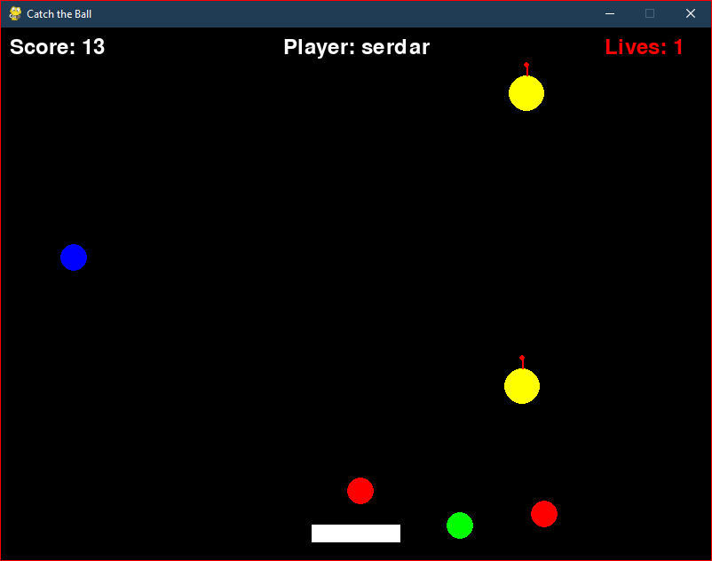

# Catch the Ball Game
[](https://github.com/mavrikant/catch-the-ball/actions)
[](htmlcov/index.html)
[](LICENSE)

A fun and challenging arcade-style game built with Pygame where players need to catch colored balls while avoiding bombs!



## Features

- Simple and addictive gameplay
- Increasing difficulty as you score higher
- Three different colored balls to catch
- Bombs to avoid
- Local high score system
- Player name customization

## Requirements

- Python 3.8+
- Pygame

## Installation

1. Clone this repository:
```bash
git clone https://github.com/mavrikant/catch-the-ball.git
cd catch-the-ball
```

2. Install the required packages:
```bash
pip install -r requirements.txt
```

## How to Play

1. Run the game:
```bash
python main.py
```

2. Enter your name when prompted
3. Use LEFT and RIGHT arrow keys to move the paddle
4. Catch the colored balls to score points
5. Avoid the bombs (yellow with red fuse)
6. You have 3 lives - game ends when all lives are lost
7. Press SPACE to restart after game over

## Game Rules

- Each caught ball = 1 point
- Each caught bomb = -1 life
- Game starts with 3 lives
- Game gets progressively harder:
  - Balls spawn more frequently as score increases
  - Bombs spawn more frequently as score increases
  - Balls have random speeds between 3-7
  - Bombs have random speeds between 2-5

## Development

### Project Structure
```
catch-the-ball/
├── src/
│   ├── main.py              # Game entry point and main loop
│   └── game_classes.py      # Game objects and logic
├── requirements.txt         # Python dependencies
├── scores.json              # High scores storage
├── tests/                  # Test files
│   ├── test_game.py        # Game logic tests
│   └── test_main.py        # Main loop tests
└── README.md                # This file
```

### Running Tests

```bash
pytest
```

## Contributing

1. Fork the repository
2. Create your feature branch (`git checkout -b feature/AmazingFeature`)
3. Commit your changes (`git commit -m 'Add some AmazingFeature'`)
4. Push to the branch (`git push origin feature/AmazingFeature`)
5. Open a Pull Request

## License

This project is licensed under the MIT License - see the [LICENSE](LICENSE) file for details.

## Acknowledgments

- Built with [Pygame](https://www.pygame.org/)
- Thanks to all contributors and players!

<!-- Disclaimer added below -->
DISCLAIMER: This game is developed using GitHub Copilot agent. No code of file is edited by any human.